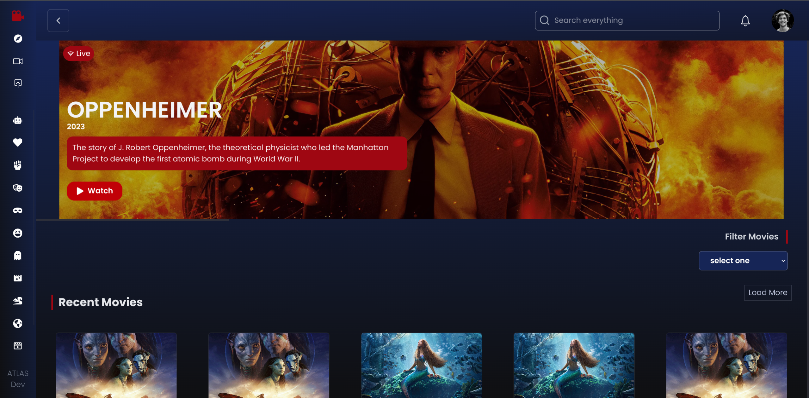

# Izacu

Izacu is a simple movie-browsing website where users can enter without registration and freely explore available movies. The goal of Izacu is to provide a clean, fast, and distraction-free experience where visitors can watch films without logging in, leaving comments, or giving ratings. The website also includes an admin dashboard that will later provide movie management tools, database analytics, and visitor insights.

The entire project is still under development, and many features are being added step by step.

## Current Homepage UI

Below is the current homepage interface for Izacu.  

## Tech Stack

- React.js  
- Tailwind CSS  
- Framer Motion  
- Node.js  
- Express.js  
- PostgreSQL  
- Prisma ORM  
- Multer  
- Cloudinary

## Tech tools
- git
- github
- nion
- etc...

## Development Status

This project is actively being built. Many features, UI components, and backend functionalities are still in progress. Future updates will include movie CRUD operations, admin analytics, advanced filtering, and improved UI interactions.

---

